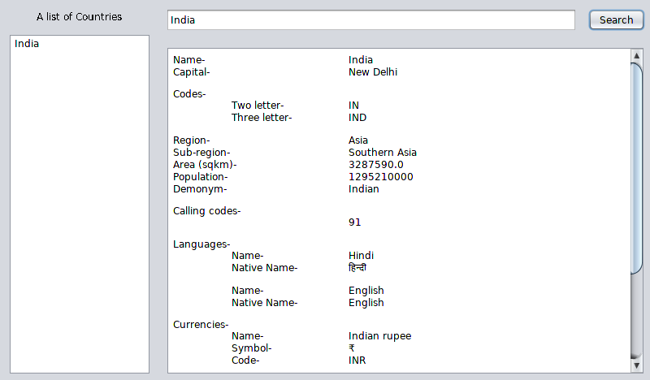

# Countripedia
An application to get information about a country. 
Uses the restcountries api. 

# Usage
Enter the name of the country on prompt (full name). 
If found, the country's information, as obtained from the API will be displayed. 
 
<b>Demo-</b> 

  

# API Information
[REST Countries](https://restcountries.eu/)

# Dependency
[Gson](https://github.com/google/gson)
