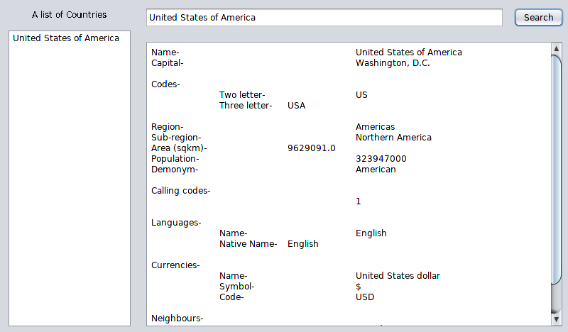

# Countripedia
An application to get information about a country. 
Uses the restcountries api. 

[Check out our Android Application!](https://github.com/rincemust/Countripedia-Android)

# Usage
Enter the name of the country in the search bar. 
As you enter the name, the countries will be filtered out. 
Click on the country who's information you want and press the search button. 
If found, the country's information, as obtained from the API will be displayed. 
 
<b>Demo-</b> 
  

  

# API Information
[REST Countries](https://restcountries.eu/)

# Dependency
[Gson](https://github.com/google/gson)

# Building the Application
1. Download the GSON jar files. Instructions are given in the GSON repository (see dependencies).
2. EITHER-
	1. Make a new project in a java IDE (netbeans was used for this project) and add the GSON library as a library for the project. The IDE should automatically build the files.  
OR  
	2. Using the command line, either add the GSON jar file in your $CLASSPATH variable or do so using `javac -cp <classpath> <all java files>` and run it using `java -cp <classpath> <class file with the main function>`

# Warning
Several exceptions may be thrown by the application. It does not affect the functioning of the application. These exceptions will be fixed in due time. 
